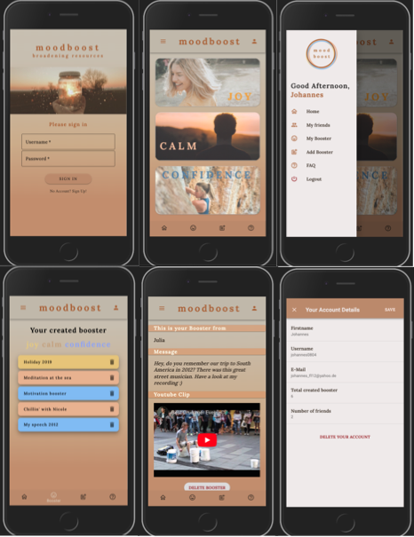

# MoodBoost

## About

In today’s fast-paced, stressed world, emotional resources such as joy, calm, and confidence are scarce. Broaden your resources with Moodboost and create individual boosters in form of personal messages, YouTube videos, or images for yourself and friends that lift your mood when you need it.

## Functionality overview

- Login and register
- Add / delete other users to your friendlist
- Create booster for you and/or your friends
- List all booster you have created
- Delete all booster you have created
- Access booster that were created for you using the Joy, Calm or Confidence - button.
- View your userprofile to access some basic data
- Delete your account

## Impressions

### Frontend

To start the dev server go to the frontend folder and run npm install and npm start

